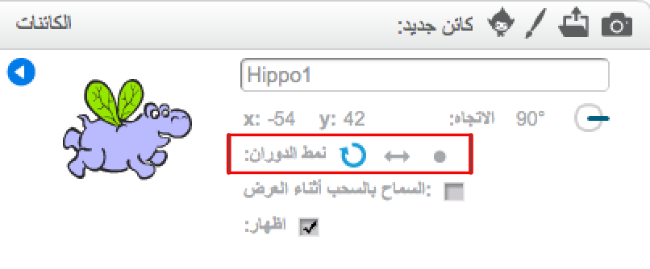

يمكنك تعيين نمط دوران الكائن.

+ انقر فوق الرمز **i** الأزرق بجوار الكائن في قائمة **الكائنات**.

+ انقر فوق نمط الدوران الذي تريده.

الأنماط هي:
- دوران كامل — يقوم بتدوير الكائن في الاتجاه الذي تواجهه
- يسار–يمين — يغيِّر اتجاه الكائن إلى اليمين أو إلى اليسار فقط
- عدم الدوران — يظل الكائن كما هو بغض النظر عن اتجاهه
