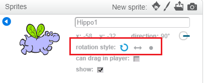

Можете да зададете по какъв начин да се върти sprite.

- Кликнете върху синия **i** близо до спрата в панела **Sprites**.

- Кликнете върху желания стил на завъртане.

Стилът е:

- Пълно завъртане - посочва спрата в посоката, в която е обърната
- Отляво надясно - обръща само sprite наляво или надясно
- Не завъртайте - спритът изглежда по същия начин, независимо от посоката, в която се намира