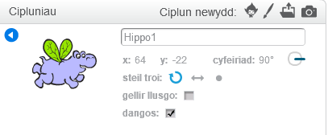

Gallwch chi ddewis sut mae'r ciplun yn troi.

- Cliciwch ar yr **i** glas ger y ciplun yn y panel **Cipluniau**.

- Cliciwch ar yr steil troi yr ydych ei eisiau.

Dyma'r steiliau:

- Cylchdro llawn - pwyntio y ciplun yng ngyfeiriad y mae'n ei wynebu
- Chwith i dde - trosi y ciplun i'r dde neu i'r chwith yn unig
- Dim cylchdroad - mae'r ciplun yn edrych yr un ffordd, waeth beth bynag gyfeiriad y mae'n ei wynebu