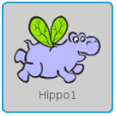
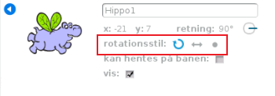

Du kan indstille hvilken måde en sprite roterer.

- Klik på den blå **i** nær sprite i **Sprites** panelet.

- Klik på den ønskede rotationsstil.

Stilarterne er:

- Fuld rotation - peger sprite i den retning, den vender mod
- Venstre-højre - springer kun sprite til venstre eller højre
- Drej ikke - sprite ser det samme uanset hvilken retning den vender mod