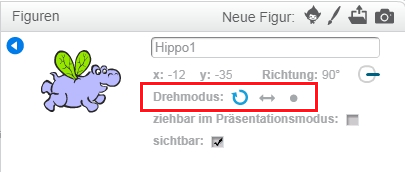

Du kannst festlegen, wie sich eine Figur dreht.

- Klicke auf das blaue **i** neben der Figur im **Figuren**-Feld.

- Klicke auf den gewünschten Drehmodus.

Die Stile sind:

- Volle Drehung - zeigt das Sprite in die Richtung, in die es zeigt
- Links-rechts - dreht das Sprite nur nach links oder rechts
- Nicht rotieren - die Figur sieht immer gleich aus, egal in welche Richtung sie zeigt