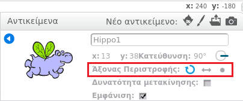

Μπορείς να ορίσεις το πως περιστρέφεται ένα αντικείμενο.

- Κάνε κλικ στο μπλε **i** στο αντικείμενο που θες, στην περιοχή **Αντικείμενα**.

- Κάνε κλικ στο στυλ περιστροφής που θέλεις.

Τα στυλ είναι:

- Πλήρης περιστροφή - στρέφει το αντικείμενο στην κατεύθυνση που βλέπει
- Αριστερά-δεξιά: στρέφει το αντικείμενο αριστερά ή δεξιά μόνο
- Μην περιστρέφεις: το αντικείμενο φαίνεται το ίδιο ανεξάρτητα από την κατεύθυνση στην οποία βλέπει