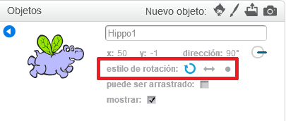

Puedes establecer en qué sentido rota un objeto.

- Haz clic en la **i** azul cerca del sprite en el panel **Objetos**.

- Haz clic en el estilo de rotación que quieras.

Los estilos son:

- Rotación completa: apunta al objeto en la dirección hacia la que está mirando
- Izquierda-derecha: gira el objeto solo hacia la izquierda o hacia la derecha
- No rotar: el objeto se ve igual, independientemente de la dirección hacia la que está mirando