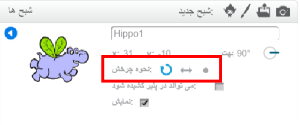

شما می توانید تعیین کنید که شبح چگونه می‌چرخد.

- روی **i** آبی رنگ کنار شبح در قسمت پانل **Sprites** کلیک کنید.

- روی سبک چرخشی که می‌خواهید، کلیک کنید.

سبک ها عبارتند از:

- چرخش کامل - نوک شبح به همان سمتی که مقابلش است، میچرخد
- چپ-راست - شبح فقط به راست یا چپ می‌چرخد
- بدون چرخش - شبح فارغ از اینکه نوکش به چه سمتی است، ثابت میماند