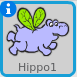
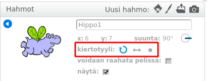

Voit määrittää, millä tavalla sprite pyörii.

- Napsauta **i** sinistä **Sprites** -paneelissa olevaa spriteä lähellä.

- Napsauta haluamaasi pyöritystyyliä.

Tyylit ovat:

- Täysi kiertyminen - osoittaa spriteä sen suunnassa
- Vasen oikea - käännä sprite vain vasemmalle tai oikealle
- Älä pyöritä - sprite näyttää samalta riippumatta siitä, mihin suuntaan se on