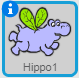
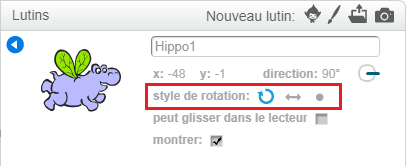

Vous pouvez définir la manière dont un lutin pivote.

- Clique sur le **i** bleu près du lutin dans le panneau **lutin**.

- Clique sur le style de rotation que tu veux.

Les styles sont:

- Rotation complète - le lutin pointe dans la direction à laquelle il fait face
- Gauche-droite - retourne le lutin à gauche ou à droite uniquement
- Ne pas faire pivoter - le lutin a la même apparence, quelle que soit la direction