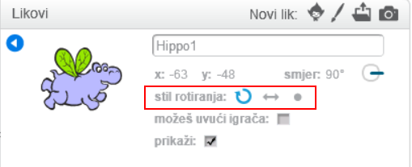

Možeš postaviti na koji način se lik rotira.

- Klikni na plavo slovo **i** u blizini lika u području **Likovi**.

- Klikni na željeni stil rotacije.

Stilovi su:

- Potpuna rotacija - usmjerava lika u smjeru u kojem je okrenut
- Lijevo - desno - okreće lika samo lijevo ili desno
- Bez rotacije - lik izgleda isto, bez obzira u kojem smjeru je okrenut