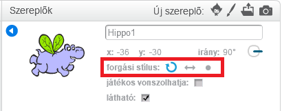

Beállíthatja, hogy a sprite hogyan forduljon el.

- Kattintson a kék **i** a sprite közelében a **Sprites** panelben.

- Kattintson a kívánt forgatási stílusra.

A stílusok:

- Teljes forgatás - a sprite irányába mutat
- Bal-jobb - csak balra vagy jobbra fordítja a sprite-t
- Ne forgassa el - a sprite ugyanúgy néz ki, függetlenül attól, hogy melyik irányba néz