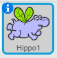
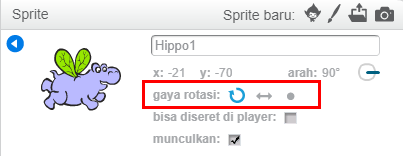

Kamu dapat mengatur ke arah mana sprite berputar.

- Klik pada simbol **i** berwarna biru dekat dengan sprite yang terdapat pada panel **Sprite**.

- Klik pada gaya rotasi yang Kamu inginkan.

Gaya yang tersedia adalah:

- Rotasi penuh - menunjukkan sprite ke arah yang dihadapinya
- Kiri-kanan - membalik sprite kiri atau kanan saja
- Jangan diputar - sprite terlihat sama terlepas dari arah mana yang menghadapinya