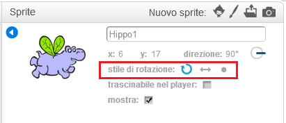

È possibile impostare il modo in cui uno sprite ruota.

- Fai click sulla **i** blu che si trova vicino allo sprite nel pannello **Sprite**.

- Fai click sullo stile di rotazione che preferisci.

Gli stili sono:

- Rotazione completa: lo sprite punta nella direzione verso cui è rivolto
- Sinistra-destra: lo sprite viene ribaltato a sinistra o a destra
- Non ruotare: lo sprite mantiene sempre lo stesso aspetto indipendentemente dalla direzione verso cui è rivolto