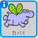
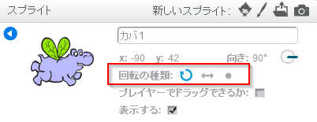

スプライトの回転方法を設定できます。

- **スプライト**パネルの中にある、スプライトの左上の**i** をクリックします。

- 好きな回転の種類を選んでクリックします。

スタイルは次の通りです。

- 自由に回転 -​​ スプライトが向いている方向を指します。
- 左右のみ - スプライトを左または右のみに、向きを変えるようにします。
- 回転しない - どの方向に向いていてもスプライトは同じように見えます。