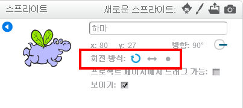

스프라이트가 회전하는 방식을 설정할 수 있습니다.

- **스프라이트** 패널의 스프라이트 근처의 파란색 **i** 을 클릭하십시오.

- 원하는 회전 스타일을 클릭하십시오.

스타일은 다음과 같습니다.

- 전체 회전 - 스프라이트가 향하는 방향으로 스프라이트를 향하게합니다.
- 왼쪽에서 오른쪽으로 - 스프라이트를 왼쪽 또는 오른쪽으로 만 뒤집습니다.
- 회전하지 않음 - 스프라이트는 직면 방향에 관계없이 동일하게 보입니다.