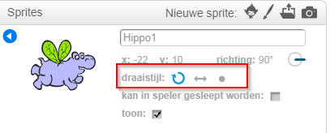

Je kunt de manier waarop een sprite draait instellen.

- Klik in het venster **Sprites** bij de sprite op de blauwe **i**.

- Klik op de gewenste rotatiestijl.

De stijlen zijn:

- Volledige rotatie - richt de sprite in de richting waarin hij gaat
- Links-rechts - richt de sprite alleen naar links of rechts
- Roteer niet - de sprite ziet er hetzelfde uit, ongeacht de richting waarin hij gaat