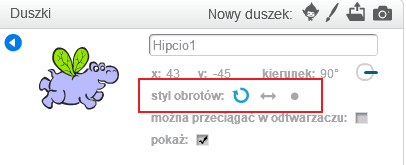

Aby ustawić sposób rotacji postaci:

- Kliknij niebieskie **i** w pobliżu duszka w panelu **Duszki**.

- Kliknij wybrany przez Ciebie styl obrotu.

Style to:

- Pełny obrót - ustawia postać w kierunku, w którym jest zwrócona
- Lewo-prawo - odwraca postać w lewo lub w prawo
- Nie obracaj - postać wygląda tak samo niezależnie od kierunku w którym jest zwrócona
