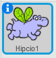

Możesz ustawić, w jaki sposób obraca się duszek.

- Kliknij niebieskie **i** w pobliżu duszka w panelu **Duszki**.

- Kliknij wybrany przez Ciebie styl obrotu.

Style to:

- Pełny obrót - ustawia duszka w kierunku, w którym jest zwrócony
- Lewo-prawo - odwraca duszka tylko w lewo lub w prawo
- Nie obracaj - duszek wygląda tak samo niezależnie od kierunku, w którym jest zwrócony