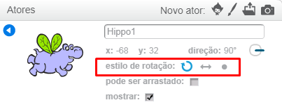

Você pode definir de que maneira um sprite gira.

- Clique **i** azul próximo ao ator no painel **Atores**.

- Clique no estilo de rotação desejado.

Os estilos são:

- Rotação total - aponta o ator na direção em frente
- Esquerda-Direita — Inverte o ator para a esquerda ou para a direita
- Não gire - o sprite parece o mesmo independentemente da direção em que está voltado