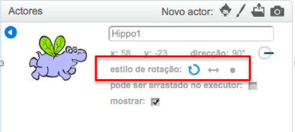

Podes definir de que maneira um actor gira.

- Clica no **i** azul perto do actor no painel **Actores**.

- Clique no estilo de rotação desejado.

Os estilos são:

- Rotação total - aponta o sprite na direção em frente
- Esquerda-direita - Apenas inverte o actor para a esquerda ou para a direita
- Não gire - o actor parece o mesmo independentemente da direção em que está voltado