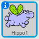
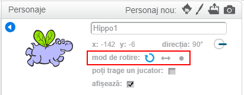

Puteți stabili modul în care un personaj se rotește.

- Faceți clic pe **i**-ul albastru de lângă personaj, din panoul **Personaje**.

- Faceți clic pe stilul de rotire dorit.

Stilurile sunt:

- Rotire completă - personajul va fi cu fața în direcția în care se îndreaptă
- Stânga-dreapta - întoarce personajul numai spre stânga sau spre dreapta
- Nu rotiți - personajul arată la fel, indiferent de direcția în care se îndreaptă