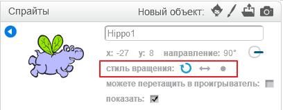

Вы можете установить, каким образом спрайт вращается.

- Нажмите на синий **i** возле спрайта на панели **Sprites**.

- Нажмите на стиль вращения, который вы хотите.

Стили:

- Полное вращение - указывает спрайт в направлении, в котором он находится
- Влево-вправо - сбрасывает спрайт только влево или вправо
- Не вращать - спрайт выглядит одинаково независимо от того, в каком направлении он обращен