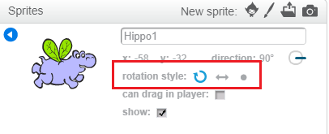

You can set which way a sprite rotates.

- Click on the blue **i** near the sprite in the **Sprites** panel.

- Click on the rotation style you want.

The styles are:

- Full rotation — points the sprite in the direction it is facing
- Left–right — flips the sprite left or right only
- Don't rotate — the sprite looks the same regardless of which direction it is facing