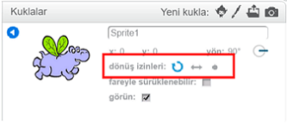

Bir kuklanın hangi şekilde döneceğini ayarlayabilirsiniz.

- **Kuklalar** panelinde kuklanın yanındaki mavi **i** üzerine tıklayın.

- İstediğiniz dönüş izni üzerine tıklayın.

Dönüş izinleri şunlardır:

- Tam dönüş - kukla, fare ile birlikte istenilen yöne döndürülebilir
- Sol-sağ \--- kuklayı sadece sola veya sağa döndürür
- Döndürme yok - halihazırda hangi yöne dönük olduğundan bağımsız olarak kukla olduğu yönde kalır