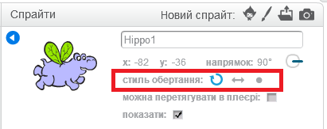

Ви можете вказати, яким чином спрайт обертається.

- Клацніть на синьому **i** біля спрайту на панелі **Sprites**.

- Натисніть на потрібний стиль обертання.

Стилі:

- Повний поворот - вказує спрайт у напрямку, з яким він стоїть
- Зліва направо - перевертає спрайт ліворуч або праворуч
- Не обертайте - спрайт виглядає однаково незалежно від того, з якого напрямку він стоїть