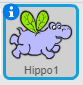

آپ اس طرح مقرر کر سکتے ہیں کہ کس طرح ایک چھلانگ گھومتا ہے.

- **اسپرت** پینل میں سپرے کے قریب نیلے **میں** پر کلک کریں.

- آپ چاہتے ہیں کہ گردش انداز پر کلک کریں.

شیلیوں ہیں:

- مکمل گردش - اس کا سامنا کرنے والی سمت میں سپرے
- بائیں دائیں - صرف چکنائی یا دائیں چھڑکیں
- باری باری نہ کریں - سپرے اس کا قطع نظر نظر آتے ہیں، جس کا سامنا کرنا پڑتا ہے